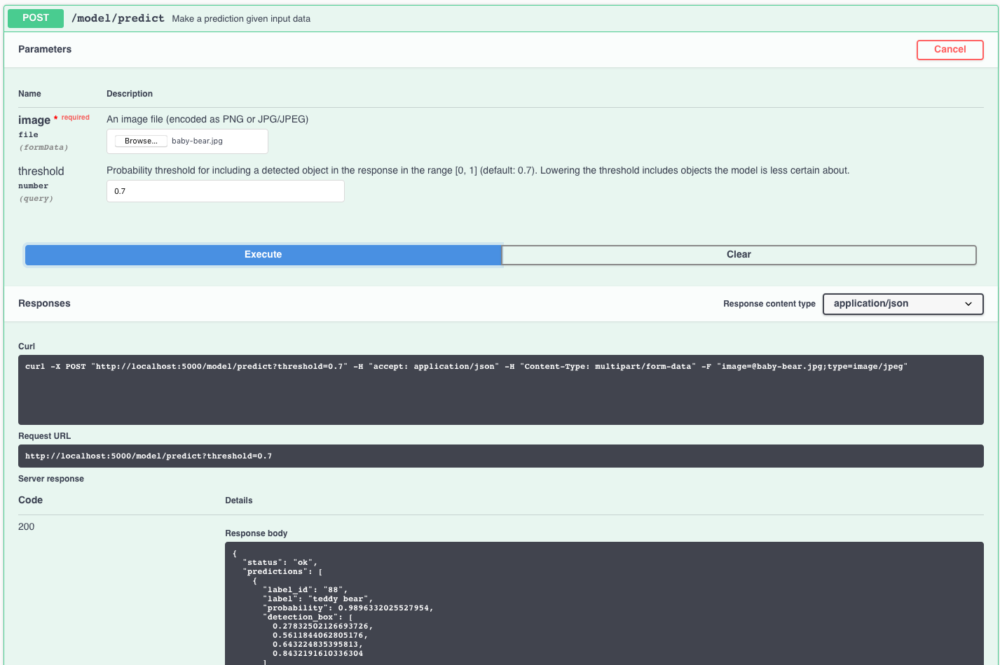
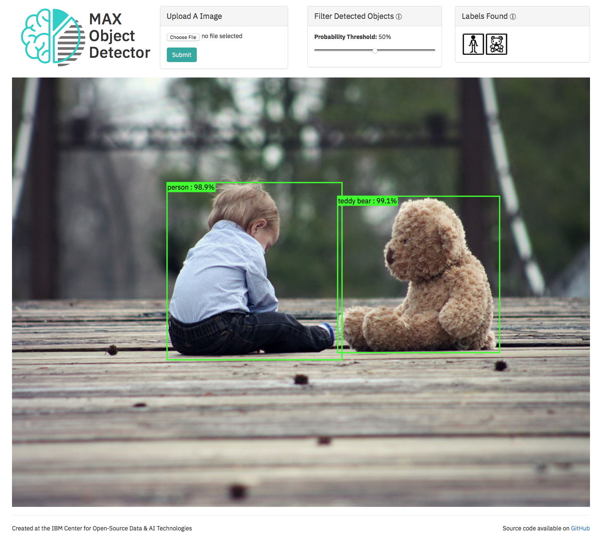

[](https://travis-ci.com/IBM/MAX-Object-Detector) [](http://max-object-detector.codait-prod-41208c73af8fca213512856c7a09db52-0000.us-east.containers.appdomain.cloud)

[](http://ibm.biz/max-to-ibm-cloud-tutorial)

# IBM Developer Model Asset Exchange: Object Detector

This repository contains code to instantiate and deploy an object detection model. This model recognizes the objects
present in an image from the 80 different high-level classes of objects in the [COCO Dataset](http://mscoco.org/). The
model consists of a deep convolutional net base model for image feature extraction, together with additional
convolutional layers specialized for the task of object detection, that was trained on the COCO data set. The input to
the model is an image, and the output is a list of estimated class probabilities for the objects detected in the image.

The model is based on the [SSD Mobilenet V1 and Faster RCNN ResNet101 object detection model for TensorFlow](https://github.com/tensorflow/models/blob/master/research/object_detection/g3doc/detection_model_zoo.md). The model files are hosted on IBM Cloud Object Storage: [ssd_mobilenet_v1.tar.gz](https://max-cdn.cdn.appdomain.cloud/max-object-detector/1.0.2/ssd_mobilenet_v1.tar.gz) and [faster_rcnn_resnet101.tar.gz](https://max-cdn.cdn.appdomain.cloud/max-object-detector/1.0.2/faster_rcnn_resnet101.tar.gz). The code in this repository deploys the model as a web service in a Docker container. This repository was developed as part of the [IBM Developer Model Asset Exchange](https://developer.ibm.com/exchanges/models/) and the public API is powered by [IBM Cloud](https://ibm.biz/Bdz2XM).

## Model Metadata
| Domain | Application | Industry  | Framework | Training Data | Input Data Format |
| ------------- | --------  | -------- | --------- | --------- | -------------- |
| Vision | Object Detection | General | TensorFlow | [COCO Dataset](http://mscoco.org/) | Image (RGB/HWC) |

## References

* _J. Huang, V. Rathod, C. Sun, M. Zhu, A. Korattikara, A. Fathi, I. Fischer, Z. Wojna,
Y. Song, S. Guadarrama, K. Murphy_, ["Speed/accuracy trade-offs for modern convolutional object detectors"](https://arxiv.org/abs/1611.10012), CVPR 2017
* _Tsung-Yi Lin, M. Maire, S. Belongie, L. Bourdev, R. Girshick, J. Hays, P. Perona, D. Ramanan, C. Lawrence Zitnick, P. Dollár_, ["Microsoft COCO: Common Objects in Context"](https://arxiv.org/abs/1405.0312), arXiv 2015
* _W. Liu, D. Anguelov, D. Erhan, C. Szegedy, S. Reed, C. Fu, A. C. Berg_, ["SSD: Single Shot MultiBox Detector
"](https://arxiv.org/pdf/1512.02325), CoRR (abs/1512.02325), 2016
* _A.G. Howard, M. Zhu, B. Chen, D. Kalenichenko, W. Wang, T. Weyand, M. Andreetto, H. Adam_, ["MobileNets: Efficient Convolutional Neural Networks for Mobile Vision Applications"](https://arxiv.org/abs/1704.04861), arXiv 2017
* [TensorFlow Object Detection GitHub Repo](https://github.com/tensorflow/models/tree/master/research/object_detection)

## Licenses

| Component | License | Link  |
| ------------- | --------  | -------- |
| This repository | [Apache 2.0](https://www.apache.org/licenses/LICENSE-2.0) | [LICENSE](LICENSE) |
| Model Weights | [Apache 2.0](https://www.apache.org/licenses/LICENSE-2.0) | [TensorFlow Models Repo](https://github.com/tensorflow/models/blob/master/LICENSE) |
| Model Code (3rd party) |  [Apache 2.0](https://www.apache.org/licenses/LICENSE-2.0) | [TensorFlow Models Repo](https://github.com/tensorflow/models/blob/master/LICENSE) |
| Test Samples | Various | [Samples README](samples/README.md) |

## Pre-requisites:

* `docker`: The [Docker](https://www.docker.com/) command-line interface. Follow the [installation instructions](https://docs.docker.com/install/) for your system.
* The minimum recommended resources for this model is 2GB Memory and 2 CPUs.
* If you are on x86-64/AMD64, your CPU must support [AVX](https://en.wikipedia.org/wiki/Advanced_Vector_Extensions) at the minimum.

# Deployment options

* [Deploy from Quay](#deploy-from-quay)
* [Deploy on Red Hat OpenShift](#deploy-on-red-hat-openshift)
* [Deploy on Kubernetes](#deploy-on-kubernetes)
* [Deploy on Code Engine](#deploy-on-code-engine)
* [Run Locally](#run-locally)

## Deploy from Quay

To run the docker image, which automatically starts the model serving API, run:

Intel CPUs:
```bash
$ docker run -it -p 5000:5000 quay.io/codait/max-object-detector
```

ARM CPUs (eg Raspberry Pi):
```bash
$ docker run -it -p 5000:5000 quay.io/codait/max-object-detector:arm-arm32v7-latest
```

This will pull a pre-built image from the Quay.io container registry (or use an existing image if already cached locally) and run it.
If you'd rather checkout and build the model locally you can follow the [run locally](#run-locally) steps below.

## Deploy on Red Hat OpenShift

You can deploy the model-serving microservice on Red Hat OpenShift by following the instructions for the OpenShift web
console or the OpenShift Container Platform CLI in [this tutorial](https://developer.ibm.com/tutorials/deploy-a-model-asset-exchange-microservice-on-red-hat-openshift/),
specifying `quay.io/codait/max-object-detector` as the image name.

## Deploy on Kubernetes

You can also deploy the model on Kubernetes using the latest docker image on Quay.

On your Kubernetes cluster, run the following commands:

```bash
$ kubectl apply -f https://raw.githubusercontent.com/IBM/MAX-Object-Detector/master/max-object-detector.yaml
```

The model will be available internally at port `5000`, but can also be accessed externally through the `NodePort`.

A more elaborate tutorial on how to deploy this MAX model to production on [IBM Cloud](https://ibm.biz/Bdz2XM) can be
found [here](http://ibm.biz/max-to-ibm-cloud-tutorial).

## Deploy on Code Engine

You can also deploy the model on IBM Cloud's [Code Engine](https://cloud.ibm.com/codeengine/) platform which is based on the Knative serverless framework. Once authenticated with your IBM Cloud account, run the commands below.

Create a Code Engine project, give it a unique name

```bash
$ ibmcloud ce project create --name sandbox
```

Run the container by pointing to the [quay.io](quay.io/codait/max-object-detector) image and exposting port 5000.

```bash
$ ibmcloud ce application create --name max-object-detector --image quay.io/codait/max-object-detector --port 5000
```

Open the resulting URL in a browser, append `/app` to view the app instead of the API.

## Run Locally

1. [Build the Model](#1-build-the-model)
2. [Deploy the Model](#2-deploy-the-model)
3. [Use the Model](#3-use-the-model)
4. [Run the Notebook](#4-run-the-notebook)
5. [Development](#5-development)
6. [Cleanup](#6-cleanup)


### 1. Build the Model

Clone this repository locally. In a terminal, run the following command:

```bash
$ git clone https://github.com/IBM/MAX-Object-Detector.git
```

Change directory into the repository base folder:

```bash
$ cd MAX-Object-Detector
```

To build the docker image locally for Intel CPUs, run:

```bash
$ docker build -t max-object-detector .
```

To select a model, pass in the `--build-arg model=<desired-model>` switch:

```bash
$ docker build --build-arg model=faster_rcnn_resnet101 -t max-object-detector .
```

Currently we support two models, `ssd_mobilenet_v1` (default) and `faster_rcnn_resnet101`.

For ARM CPUs (eg Raspberry Pi), run:

```bash
$ docker build -f Dockerfile.arm32v7 -t max-object-detector .
```

All required model assets will be downloaded during the build process. _Note_ that currently this docker image is CPU only (we will add support for GPU images later).


### 2. Deploy the Model

To run the docker image, which automatically starts the model serving API, run:

```bash
$ docker run -it -p 5000:5000 max-object-detector
```

### 3. Use the Model

The API server automatically generates an interactive Swagger documentation page. Go to `http://localhost:5000` to load it. From there you can explore the API and also create test requests.

Use the `model/predict` endpoint to load a test image (you can use one of the test images from the `samples` folder) and get predicted labels for the image from the API.  The coordinates of the bounding box are returned in the `detection_box` field, and contain the array of normalized coordinates (ranging from 0 to 1) in the form `[ymin, xmin, ymax, xmax]`.



You can also test it on the command line, for example:

```bash
$ curl -F "image=@samples/dog-human.jpg" -XPOST http://127.0.0.1:5000/model/predict
```

You should see a JSON response like that below:

```json
{
  "status": "ok",
  "predictions": [
      {
          "label_id": "1",
          "label": "person",
          "probability": 0.944034993648529,
          "detection_box": [
              0.1242099404335022,
              0.12507188320159912,
              0.8423267006874084,
              0.5974075794219971
          ]
      },
      {
          "label_id": "18",
          "label": "dog",
          "probability": 0.8645511865615845,
          "detection_box": [
              0.10447660088539124,
              0.17799153923988342,
              0.8422801494598389,
              0.732001781463623
          ]
      }
  ]
}
```

You can also control the probability threshold for what objects are returned using the `threshold` argument like below:

```bash
$ curl -F "image=@samples/dog-human.jpg" -XPOST http://127.0.0.1:5000/model/predict?threshold=0.5
```

The optional `threshold` parameter is the minimum `probability` value for predicted labels returned by the model.
The default value for `threshold` is `0.7`.

### 4. Run the Notebook

[The demo notebook](demo.ipynb) walks through how to use the model to detect objects in an image and visualize the results. By default, the notebook uses the [hosted demo instance](http://max-object-detector.codait-prod-41208c73af8fca213512856c7a09db52-0000.us-east.containers.appdomain.cloud/), but you can use a locally running instance (see the comments in Cell 3 for details). _Note_ the demo requires `jupyter`, `matplotlib`, `Pillow`, and `requests`.

Run the following command from the model repo base folder, in a new terminal window:

```bash
$ jupyter notebook
```

This will start the notebook server. You can launch the demo notebook by clicking on `demo.ipynb`.

### 5. Development

To run the Flask API app in debug mode, edit `config.py` to set `DEBUG = True` under the application settings. You will then need to rebuild the docker image (see [step 1](#1-build-the-model)).

### 6. Cleanup

To stop the Docker container, type `CTRL` + `C` in your terminal.

# Object Detector Web App

The latest release of the [MAX Object Detector Web App](https://github.com/IBM/MAX-Object-Detector-Web-App)
is included in the Object Detector docker image.

When the model API server is running, the web app can be accessed at `http://localhost:5000/app`
and provides interactive visualization of the bounding boxes and their related labels returned by the model.



If you wish to disable the web app, start the model serving API by running:

```bash
$ docker run -it -p 5000:5000 -e DISABLE_WEB_APP=true quay.io/codait/max-object-detector
```

## Resources and Contributions

If you are interested in contributing to the Model Asset Exchange project or have any queries, please follow the instructions [here](https://github.com/CODAIT/max-central-repo).

### Links

* [Object Detector Web App](https://developer.ibm.com/patterns/create-a-web-app-to-interact-with-objects-detected-using-machine-learning/): A reference application created by the IBM CODAIT team that uses the Object Detector
