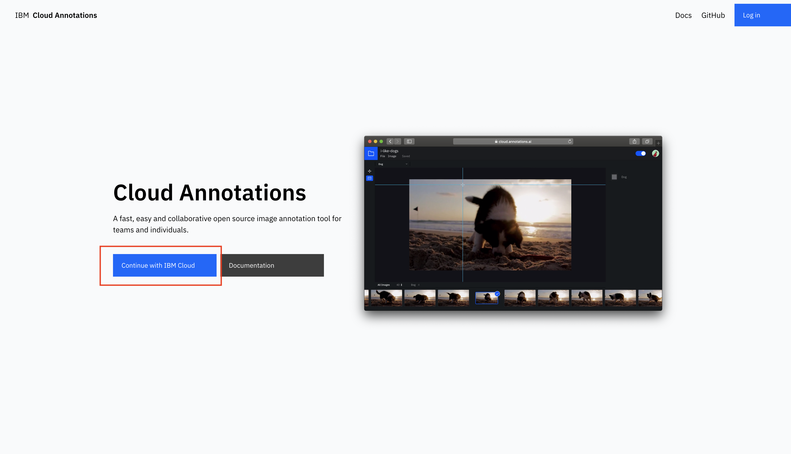
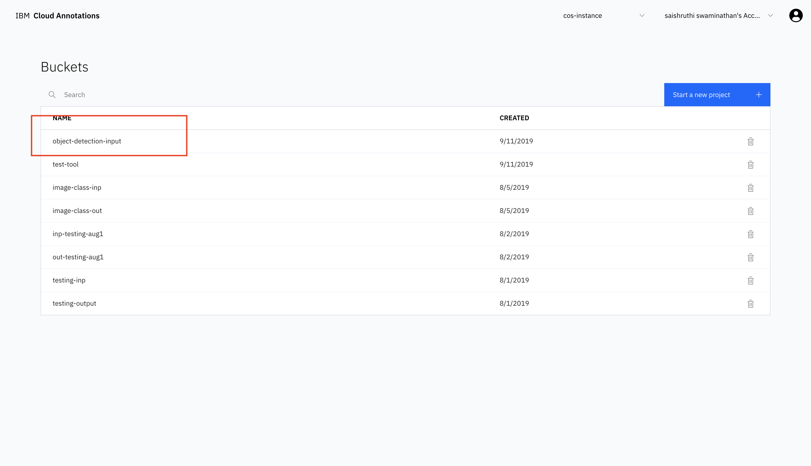
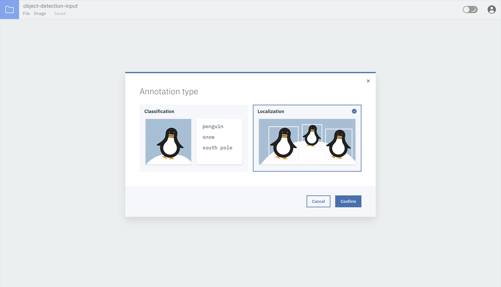
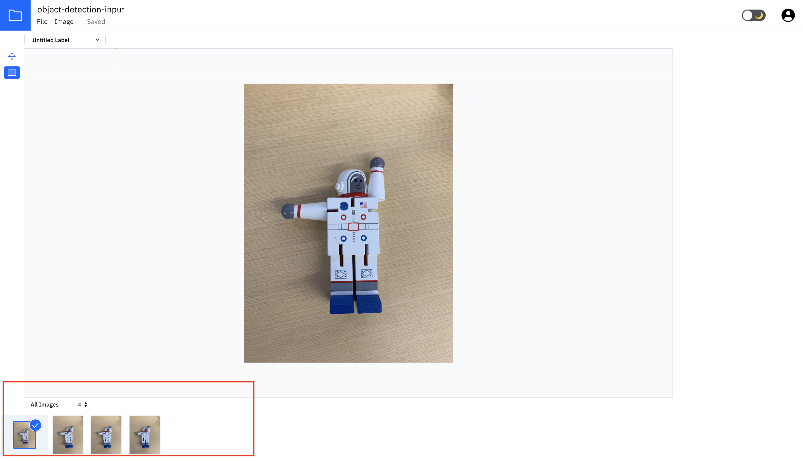
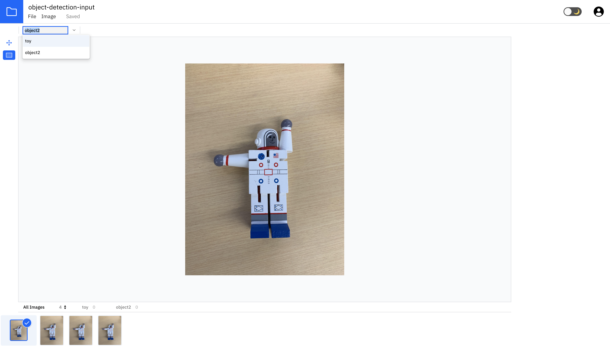
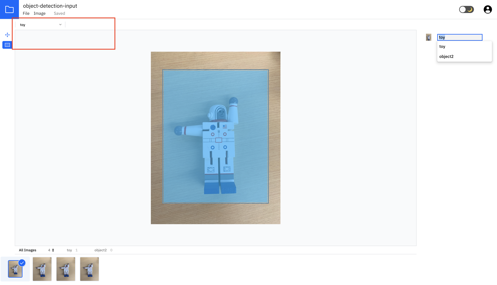
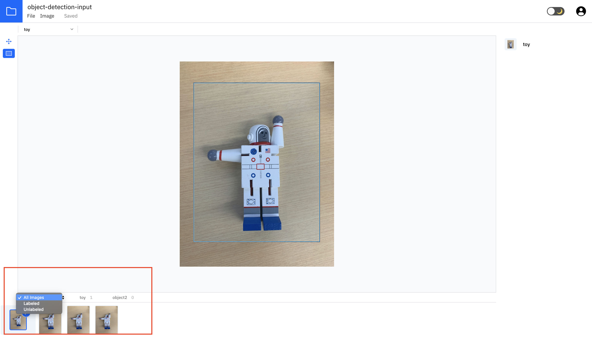

## Object Detection - Data Preparation

Training Object detection model requires images and their annotations using bounding boxes.

To ease creating annotations in Cloud Object Storage bucket, we can use [the Cloud Annotations Tool](https://cloud.annotations.ai/login), 
a fast, easy and collaborative open source image annotation tool that sits on top of IBM Cloud Object Storage that allows us to upload photos and associate them with annotations.

Follow the instructions in this document to prepare your data for training the object detector model.
- [Prerequisites](#prerequisites)
- [Preparing Your Data](#preparing-your-data)

## Prerequisites

Login into [Cloud Annotation Tool](https://cloud.annotations.ai/login) using the IBM Cloud credentials.



## Preparing Your Data

1. Choose the configured input bucket from the available buckets.

   _NOTE_ : The configured input bucket name can be obtained from the credentials displayed after running 
            the setup script. 
   
   ```bash
   
   ------------------------------------------------------------------------------
   NEW YAML CONFIGURATION VALUES
   ------------------------------------------------------------------------------
   input_bucket  : object-detector-input
   local directory  : ../data
   result bucket  : object-detector-output
   compute  : k80
   ------------------------------------------------------------------------------

   ```
   

   
2. Choose `Localization` from the options displayed on the screen and click `Confirm`.



3. Data uploaded during setup will be available inside the bucket for annotation. Click on `Add Label` to add
   class names.
   


4. Add the class names before proceeding with the annotation process.


  Continue adding label names if there are multiple objects for detection.
  


5. Click on the image to start the annotation process. Select an appropriate label from the list displayed on the
   right side of the screen. Draw bounding box around the image. Follow the same steps for other images.



6. To view only unlabeled images, click on `unlabeled` option on the bottom of the screen.




