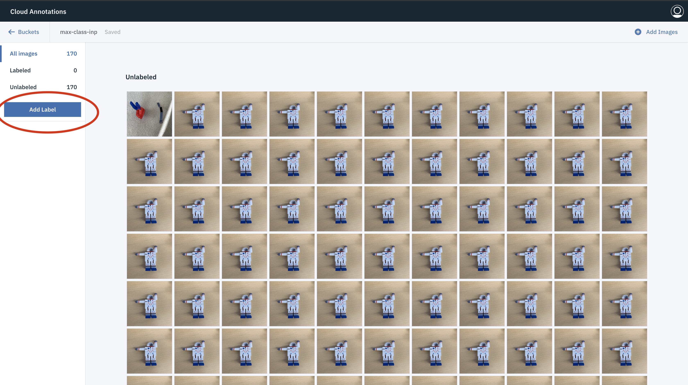

## Object Detection - Data Preparation

Follow the instructions in this document to prepare your data for training the object detector model.
- [Prerequisites](#prerequisites)
- [Preparing Your Data](#preparing-your-data)

## Prerequisites

1. Retrieve `apikey` from the credentials displayed after running setup script.

2. Retrieve `resource_instance_id` by:
   
   * Login into IBM Cloud.
   
   * Click on `Storage` under `Resource Summary`. 
   
   * Click on the appropriate Cloud Object Storage instance name.
   
     _NOTE_ : The instance name should be the one you have chosen during setup.
     
   * Click on `Service Credentials` and choose the appropriate key name.
   
     _NOTE_ : The key name should be the one you have chosen during setup.
   
   * Retrieve value corresponding to `resource_instance_id`.

2. Login into [Cloud Annotation Tool](https://cloud.annotations.ai/login) using the above retrieved credentials.

## Preparing Your Data

1. Choose the configured input bucket from the available buckets.

   _NOTE_ : The configured input bucket name can be obtained from the credentials displayed after running 
            the setup script. 
   
   ```bash
   
   ------------------------------------------------------------------------------
   NEW YAML CONFIGURATION VALUES
   ------------------------------------------------------------------------------
   input_bucket  : object-detector-input
   local directory  : ../obj
   result bucket  : jun11-chk-out
   compute  : k80x4
   ------------------------------------------------------------------------------

   ```
   
   

   
2. Choose `Localization` from the options displayed on the screen and click `Confirm`.


3. Data uploaded during setup will be available inside the bucket for annotation. Click on `Add Label` to add
   class names.
   


3. Click on the image to start the annotation process. Select an appropriate label from the list displayed on the
   right side of the screen. 


 
4. Draw bounding box around the image. Follow the same steps for other images.

5. To view only unlabeled images, click on `unlabeled` option on the left side of the screen.


